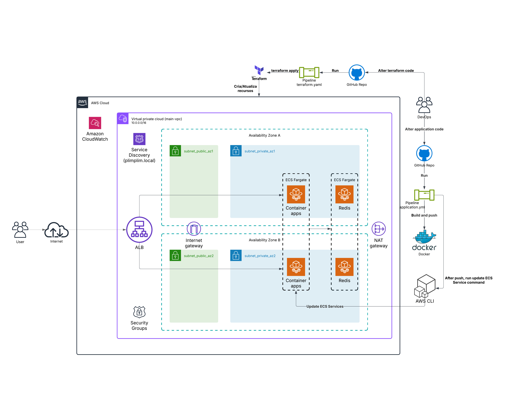

# Desafio DevOps

Este projeto explora duas abordagens para execução de aplicações: **localmente** usando Docker e **na nuvem** utilizando a AWS com Terraform. Abaixo estão os detalhes de cada abordagem, bem como instruções para execução.

---

##  **Execução Local**

A infraestrutura local foi projetada para ser simples e fácil de gerenciar, com tudo sendo controlado por um único comando. Aqui estão os principais componentes:

- **Docker Compose**: Para orquestração dos containers.
- **Dockerfiles**: Para construção das imagens das aplicações.
- **Script Bash (`start.sh`)**: Facilita o gerenciamento do ambiente, permitindo iniciar, visualizar logs, destruir e limpar imagens/volumes.

###  **Como Executar Localmente**

Para iniciar o ambiente local, execute o seguinte comando:

```bash
./start.sh
```
Este script oferece opções para iniciar os containers, visualizar logs, destruir o ambiente e limpar imagens e volumes.

##  **Execução na nuvem**

O cliente acessa as aplicações pela internet, passando pelo Internet Gateway (IGW), que direciona o tráfego para o IP externo da infraestrutura solicitada. Quando um request é feito para uma das rotas, a aplicação consulta o Redis para verificar se a resposta já está em cache.

O tempo de cache varia conforme a aplicação: na aplicação Python, o cache é válido por 10 segundos, enquanto na aplicação Go, o cache dura 1 minuto. Se um novo request for feito dentro desses intervalos, a aplicação retorna a resposta armazenada no Redis. Fora desse período, a aplicação busca as informações atualizadas, armazena-as novamente no cache e as retorna ao usuário.

As aplicações são dependentes do Redis. Se elas não conseguirem se comunicar com o servidor de cache, entram em um loop de tentativas de reconexão antes de processar qualquer requisição. Isso garante que o cache seja priorizado, mas pode impactar a disponibilidade das aplicações caso o Redis não seja criado.




A infraestrutura na nuvem foi provisionada utilizando Terraform, garantindo um ambiente replicável e de fácil manutenção. Abaixo estão os principais recursos provisionados:

- **Rede**: VPC, Subnets, Route Tables e Security Groups.
- **Service Discovery**: Resolução de nomes internos para comunicação entre serviços.
- **Cache**: Redis para armazenamento temporário de respostas das aplicações.
- **Compute**: ECS Fargate para execução das aplicações.
- **Observabilidade**: CloudWatch Logs para monitoramento e análise de logs das aplicações.
- **IAM**: Perfis de execução para os serviços com as permissões necessárias.

###  **Como Provisionar a Infraestrutura na AWS**

Para provisionar a infraestrutura na AWS manualmente, execute os seguintes comandos:

```bash
terraform init
terraform apply --auto-approve
```

###  **Dependências**

Certifique-se de ter as seguintes ferramentas instaladas antes de executar o projeto:

- **Docker e Docker Compose para execução local.**
- **Terraform para provisionamento na AWS.**
- **AWS CLI configurada com credenciais válidas.**

---

##  **Pipeline de aplicações**

Para facilitar a implementação de mudanças e garantir a entrega contínua, foi criada uma pipeline de CI/CD automatizada. Essa pipeline segue um fluxo simplificado, focando na construção, publicação e atualização dos ECS Services. Ela só irá ser executada quando os códigos das pastas app1-python e app2-go sofrerem alguma alteração

- **Build (Construção das Imagens Docker)**: As imagens Docker das aplicações são construídas a partir dos Dockerfiles definidos no projeto.
- **Push (Publicação no Docker Hub)**: Após a construção, as imagens são enviadas para o Docker Hub, garantindo que estejam disponíveis para uso em qualquer ambiente.
- **Update (Atualização da Infraestrutura Existente)**: Caso a infraestrutura já esteja implantada (por exemplo, no ECS Fargate na AWS), a pipeline atualiza os serviços com as novas imagens, garantindo que as mudanças sejam aplicadas sem interrupções.

##  **Pipeline de infraestrutura**

Para garantir que a infraestrutura esteja sempre alinhada com o código versionado no Git, foi criada uma pipeline adicional. Essa pipeline foca na validação e aplicação das mudanças de infraestrutura definidas nos módulos Terraform. Ela só irá ser executada quando os códigos da pasta terraform sofrerem alguma alteração

- **Validação (Validate)**: Valida a sintaxe e a configuração dos arquivos Terraform para garantir que não há erros.
- **Aplicação (Apply)**: Aplica as mudanças na infraestrutura, garantindo que ela esteja de acordo com o código versionado no Git.

##  **Pontos de Melhoria Identificados**

###  **Segurança e Gestão de Credenciais**

- Evitar o uso da tag latest nas imagens Docker, adotando versionamento estruturado (v1.0, hash do commit, etc.), garantindo previsibilidade e rollback mais eficiente.
- Implementar autenticação no Redis, reforçando a segurança contra acessos não autorizados.
- Utilizar um cofre de credenciais, como AWS Secrets Manager ou HashiCorp Vault, para armazenar senhas e segredos sensíveis de forma segura, substituindo os GitHub Secrets.


###  **Infraestrutura e Disponibilidade**

- Adicionar um Load Balancer, distribuindo requisições de forma equilibrada entre os containers para melhorar escalabilidade e disponibilidade
- Criar um DNS externo, facilitando o acesso às aplicações e permitindo a implementação de SSL para comunicação segura.
- Configurar Auto Scaling (ASG) no ECS, garantindo elasticidade e ajuste automático da quantidade de tasks conforme demanda.

###  **Monitoramento e Confiabilidade**

- Implementar alertas no CloudWatch, para detecção proativa de falhas e incidentes críticos.
- Adicionar health checks nos containers, garantindo que apenas instâncias saudáveis recebam tráfego.

###  **Melhoria na Arquitetura do Terraform**

- Refatorar a estrutura dos módulos Terraform, criando módulos dedicados para IAM, CloudWatch e outros componentes atualmente definidos diretamente.

###  **Processos e Ciclo de Desenvolvimento**

- Criar um ambiente de staging, com branch dedicada, permitindo testes e validação antes de promover mudanças para produção.
- Versionar infraestrutura e aplicações, garantindo rastreabilidade e maior controle sobre as mudanças.
- Incluir testes unitários na pipeline, assegurando qualidade e robustez das aplicações antes do deploy.
